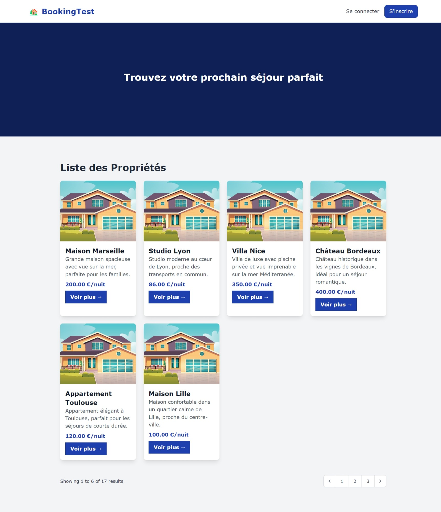
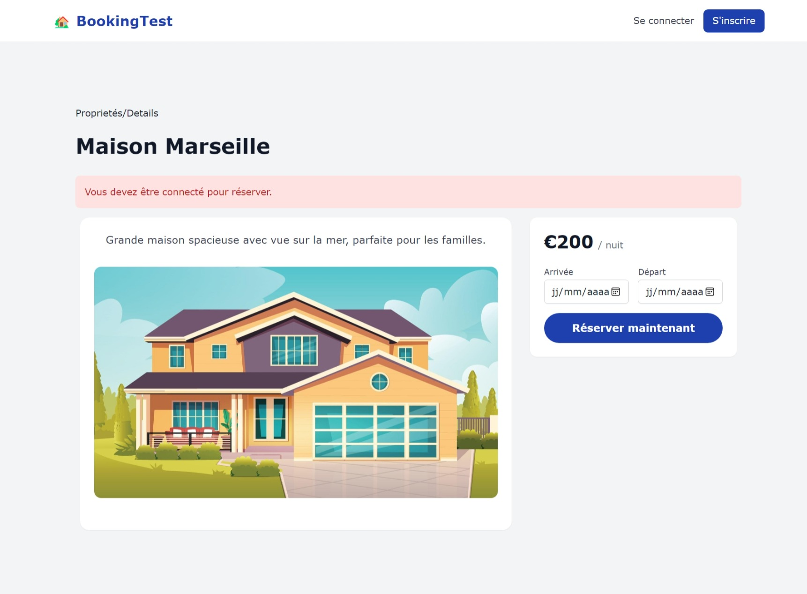
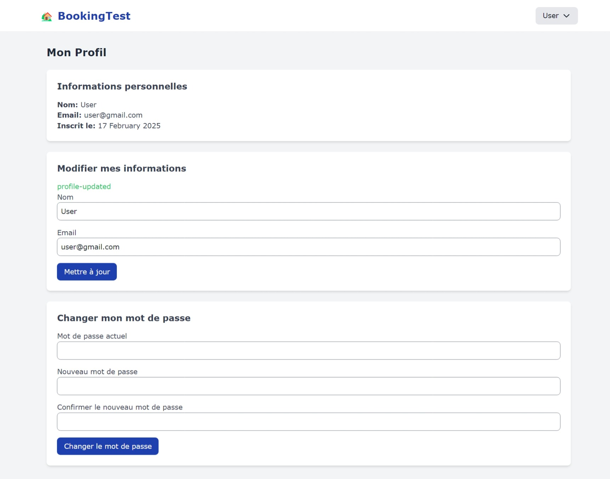
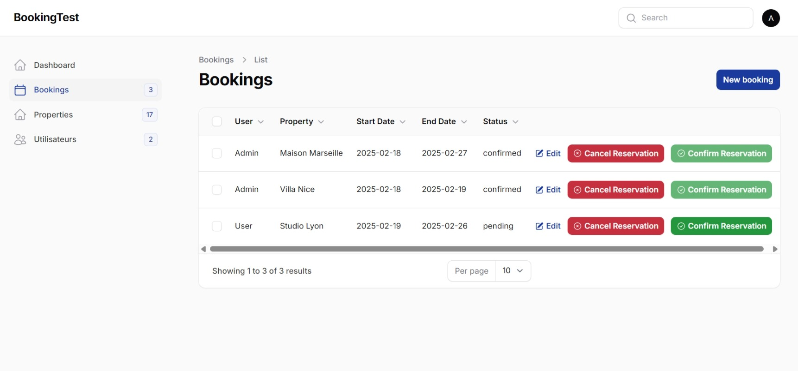

# Projet Laravel - Gestion des Réservations Immobilières

## Introduction

Ce projet a été développé dans le cadre de l'évaluation de mes compétences avec **Laravel**, **Livewire**, **Filament** et **TailwindCSS**. L'objectif de ce projet est de créer une application de gestion des réservations immobilières, permettant aux utilisateurs de consulter des propriétés, de les réserver, et de gérer leur profil ainsi que leurs réservations. Les administrateurs ont un accès complet pour gérer les utilisateurs, les réservations et les propriétés.

### Technologies utilisées :

- **Laravel** : Framework PHP pour le backend
- **Livewire** : Pour des interactions dynamiques sans rechargement de page
- **Filament** : Interface d’administration pour gérer les utilisateurs et les données
- **TailwindCSS** : Framework CSS moderne pour un design responsive et personnalisé

## Fonctionnalités du Système

### 1. **Gestion des Propriétés**

Les utilisateurs peuvent consulter les propriétés sous forme de cartes, contenant les informations principales (nom, description, prix par nuit). Un bouton "Voir plus" permet d'accéder à une page avec plus de détails.



### 2. **Réservation des Propriétés**

Un formulaire de réservation est disponible pour chaque propriété. L'utilisateur peut choisir une date de début et une date de fin. Si les dates sont déjà réservées, un message d'alerte est affiché en rouge.

- **Non connecté** : Un message d'avertissement apparaît si l'utilisateur n'est pas connecté.
- **Dates réservées** : Un message s'affiche si les dates choisies sont déjà réservées.



### 3. **Gestion des Profils Utilisateurs**

Les utilisateurs peuvent consulter et mettre à jour leurs informations personnelles, y compris leur mot de passe.



### 4. **Interface d’Administration avec Filament**

Les administrateurs peuvent accéder à une interface complète pour gérer :
- **Les utilisateurs** : Consulter, modifier, ou affecter des rôles.
- **Les réservations** : Consulter, annuler, ou confirmer les réservations.
- **Les propriétés** : Ajouter, modifier, ou supprimer des propriétés.



### 5. **Authentification et Sécurité**

Le système utilise **Laravel Breeze** pour l'authentification des utilisateurs, avec des options pour créer un compte, se connecter et réinitialiser le mot de passe.

## Structure du Projet

### 1. **Base de Données**

Le projet repose sur deux tables principales :

- **Propriétés** (`properties`) : Contient les informations des propriétés.
- **Réservations** (`bookings`) : Contient les informations des réservations effectuées par les utilisateurs.

### 2. **Routes Principales**

- `/` : Page d'accueil affichant les propriétés disponibles
- `/profile` : Page de profil de l'utilisateur
- `/mes-reservations` : Page des réservations de l'utilisateur
- `/admin` : Page d'administration, accessible uniquement aux administrateurs

## Instructions pour Exécuter le Projet Localement

### **Cas 1 : Utilisation d'un Fichier Zip**

1. **Télécharger et Extraire le Fichier Zip**
   Téléchargez le fichier zip contenant le projet et extrayez-le dans un dossier sur votre machine.

2. **Configurer l'Environnement Local**
   - Ouvrez un terminal et naviguez vers le dossier extrait.
   - Copiez le fichier `.env.example` en `.env` :
     ```bash
     cp .env.example .env
     ```

3. **Installer les Dépendances**
   Installez toutes les dépendances PHP avec Composer :
   ```bash
   composer install
